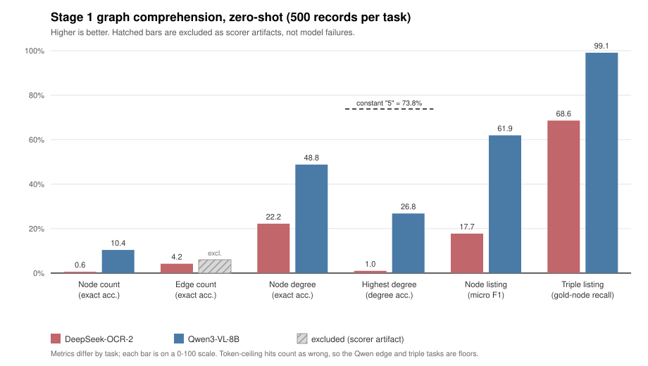

# Zero-shot results summary

## Stage 2 - OBQA question answering (500 test questions)

| Model | Condition | Accuracy | Correct | A / B / C / D |
| --- | --- | --- | --- | --- |
| DeepSeek-OCR-2 | image | 27.4% | 137/500 | 22 / 291 / 173 / 14 |
| DeepSeek-OCR-2 | text | 36.6% | 183/500 | 104 / 214 / 178 / 4 |
| DeepSeek-OCR-2 | text_noref | 41.6% | 208/500 | 79 / 226 / 167 / 28 |
| DeepSeek-OCR-2 | kg_text | 32.2% | 161/500 | 112 / 171 / 199 / 18 |
| Qwen3-VL-8B | image | 74.0% | 370/500 | 104 / 127 / 135 / 110 |
| Qwen3-VL-8B | text_noref | 88.0% | 440/500 | 124 / 122 / 133 / 113 |

Chance is 25%. A uniform predicted-letter distribution is 125 each.

### Paired significance tests (exact McNemar)

| Comparison | Better only | Worse only | p |
| --- | --- | --- | --- |
| DeepSeek text_noref vs kg_text | 92 | 45 | < 0.001 |
| DeepSeek text_noref vs image | 113 | 42 | < 0.001 |
| DeepSeek text_noref vs text | 51 | 26 | 0.006 |
| Qwen text_noref vs image | 94 | 24 | < 0.001 |

"Better only" counts questions the first condition got right and the second got wrong; "worse only" is the reverse. Agreements are discarded.

### Image penalty, both backbones

- DeepSeek-OCR-2: adding the rendered graph costs 14.2% (text_noref -> image).
- Qwen3-VL-8B: adding the rendered graph costs 14.0% (text_noref -> image).
- DeepSeek-OCR-2: supplying the same subgraph as **text** still costs 9.4%, so the failure is not a modality problem.
- Caveat: merely *referring* to a graph costs 5.0% on its own (text_noref -> text), so part of the kg_text gap is framing, not triples. A prefix-only control is still needed to separate them.

## Why the subgraph does not help - structural analysis

Computed over the pruned subgraphs only; no model involved.

- Correct answer's node has **degree zero in 111 of 500 questions (22.2%)**.
- Pairwise degree win rate, correct answer vs each distractor: **0.460** (chance 0.500, ties counted as half, 1500 pairs).
- Degree is compressed by the `max_degree=5` pruning cap: 359 answer-option slots sit at exactly 5 against 216 at 4. The cap, not ConceptNet, sets the dynamic range.

Caveat: max-degree is one way to operationalise "the graph favours this answer"; a path-based measure would be equally defensible. The result also implicates the pruning heuristic (max_nodes=18, max_edges=30, max_degree=5, which is not from the GraphVis paper) as much as ConceptNet retrieval.

## Stage 1 - graph comprehension, zero-shot (RQ1)

500 records per task, image condition only.

| Task | Metric | DeepSeek-OCR-2 | Qwen3-VL-8B |
| --- | --- | --- | --- |
| node_number | exact accuracy | 0.6% | 10.4% |
| node_number | mean abs. error | 9.5 | 15.3 |
| edge_number | exact accuracy | 4.2% | **unreliable** |
| node_degree | exact accuracy | 22.2% | 48.8% |
| node_degree | mean abs. error | 1.5 | 1.2 |
| highest_node_degree | degree accuracy | 1.0% | 26.8% |
| highest_node_degree | name accuracy (ties ok) | 41.8% | 100.0% |
| node_description | micro F1 (annot. stripped) | 0.177 | 0.619 |
| triple_listing | triple micro F1 | 0.000 | **unreliable** |
| triple_listing | gold-node recall | 68.6% | 99.1% |

**Gold-node recall is the key row.** It is computed by a code path the triple-format parser bug does not touch, so it stands even where the triple F1 does not. Qwen recovers 99.1% of gold node names from the rendered image while its triple F1 scores 0.010 - that gap is the proof the F1 is a formatting artifact, and that the model reads the graph.

**`highest_node_degree` is near-saturated.** Answering a constant "5" scores 73.8% because 369 of 500 gold degrees sit at the pruning cap. Both models score far *below* that trivial strategy, so this task is uninformative as currently constructed.

### Token-ceiling hit rates

| Task | DeepSeek-OCR-2 | Qwen3-VL-8B |
| --- | --- | --- |
| edge_number | 0.0% | 34.0% |
| highest_node_degree | 0.0% | 16.4% |
| node_degree | 0.0% | 3.8% |
| node_description | 1.0% | 0.2% |
| node_number | 0.0% | 0.8% |
| triple_listing | 0.8% | 18.0% |

A response that hits the ceiling produces no parseable answer, so a high rate makes that task's score a floor rather than a measurement. Budgets differ by necessity: DeepSeek-OCR-2 hardcodes 8192 in its remote code, Qwen was run at 1024.

### Scores excluded as measurement artifacts

- **qwen / edge_number**: parser takes the first integer; Qwen answers as a numbered list, so the list index '1' is scored instead of the total.
- **qwen / triple_listing**: parser expects (a, b, c); Qwen emits backtick-delimited triples, so only 46 of ~9388 gold triples matched despite 99.1% gold-node recall.

These are parser problems, not model failures, and need a scorer fix rather than a re-run. The predictions are already on disk.

### Qualitative: how the two models answer

- **DeepSeek-OCR-2** replies in its pretrained document-layout format, emitting `<|ref|>Node<|/ref|><|det|>[[20, 20, 60, 100], ...]` bounding boxes rather than prose, then repeating until the 8192-token ceiling. Its near-zero scores are as much a format mismatch as a comprehension failure - which is precisely what Stage 1 fine-tuning would teach.
- **Qwen3-VL** enumerates the graph correctly in prose, and on at least one record reproduces all 13 triples exactly and then adds a separate "No connections found in KG" section for the disconnected nodes.

## Standing caveats

- Visual token budgets are not equal across models and cannot be made equal: DeepSeek-OCR-2 uses base_size=1024 / image_size=768 / crop_mode (832 vision tokens); Qwen3-VL uses a pinned dynamic pixel range (1222 tokens, source 4056x2302 downscaled to 1504x832).
- The rendered graphs embed answer-choice letters in node labels (`straw [B,C]`), an addition of this implementation rather than the GraphVis paper. Stage 1 gold answers inherit them, which is why set metrics are reported with and without annotation stripping.
- The pruning heuristic (max_nodes=18, max_edges=30, max_degree=5, relation-priority ordering) has no counterpart in GraphVis, which prunes nothing. It is the prime suspect for the retrieval results above.
- Stage 1 set tasks omit disconnected nodes from the text side while the image draws them; this asymmetry is recorded in the run notes.

